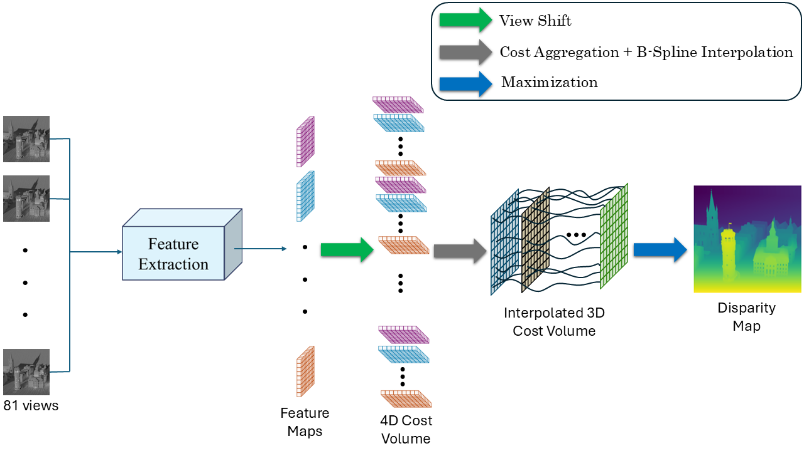

# Master-Depth-Estimation-from-Lightfield-Camera

## 1. Abstract
Accurate depth estimation from light field images is critical for 3D reconstruction in industrial automation
and computer vision applications. Building upon one of the most efficient deep learning-based techniques
that estimate subpixel disparity distributions using a discrete cost volume, this project explores the use
of operator learning by modeling the matching cost as a continuous function using cubic B-spline
interpolation over a limited number of sample points. The proposed method achieves a lower bad pixel
ratio (21.88%) compared to the baseline (23.85%), while the baseline yields a lower mean squared error
overall. However, under certain configurations, the B-spline-based model outperforms the baseline in
both metrics, achieving up to a 31.3% improvement in bad pixel ratio and a 46.5-point reduction in MSE.
These findings highlight the promise of operator learning for efficient and accurate depth estimation from
light field data.

## 2. Network Architecture 

  

## 3. Stages to Train
- Download full_data HCI Light field dataset on http://hci-lightfield.iwr.uni-heidelberg.de/.
- Unzip full_data.
- Create masks by running [boolmasks.ipynb](boolmasks.ipynb).
- Run [9BS_small_train.ipynb](9BS_small_train.ipynb).

The code is modified and heavily borrowed from [SubFocal](https://github.com/chaowentao/SubFocal?tab=readme-ov-file).
